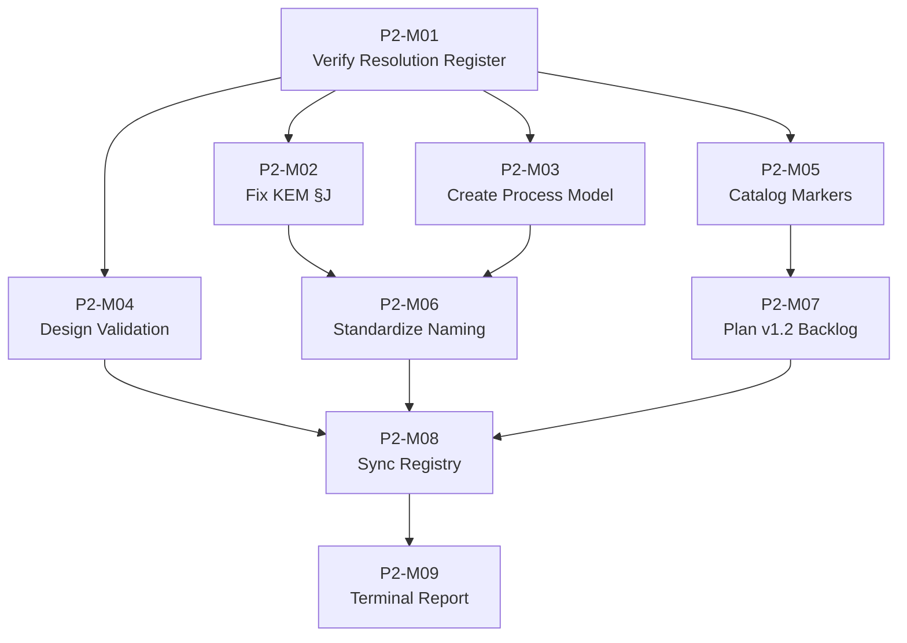

# PHASE 2 MASTER PLAN — Radius1 Engineering Kernel

**Repository:** `abdo-net/radius1-kernel`  
**Branch:** `main`  
**Base Commit:** `94ef6f415c4b0f5d30fe423eaa6378813e38d83b`  
**Document Status:** CANONICAL — Single Source of Truth for Phase 2 Execution  
**Document Owner:** Engineering Kernel Architect (role defined in `00-CONSTITUTION/KERNEL_ROLE_MODEL.md`, SHA `0344367f`)  
**Supreme Authority:** `00-CONSTITUTION/CONSTITUTION.md` (SHA `187aaaa1`)  
**RMM Reference:** `01-META-MODEL/RMM_v1.1.md` (SHA `09bc2239`, FROZEN per Constitution P-10 §14)  
**Date of Authorship:** 2026-06-27  
**Version:** 1.0.0  
**SOT Directory:** `03-PLANNING/` (per Constitution §10 directory structure)

---

## Table of Contents

1. [Section 1: Phase Objective](#section-1-phase-objective)
2. [Section 2: Scope](#section-2-scope)
3. [Section 3: Phase Deliverables](#section-3-phase-deliverables)
4. [Section 4: Mission Breakdown](#section-4-mission-breakdown)
5. [Section 5: Dependency Graph](#section-5-dependency-graph)
6. [Section 6: Parallelization Matrix](#section-6-parallelization-matrix)
7. [Section 7: Freeze Gates](#section-7-freeze-gates)
8. [Section 8: Acceptance Gates](#section-8-acceptance-gates)
9. [Section 9: Completion Criteria](#section-9-completion-criteria)
10. [Section 10: Transition Criteria](#section-10-transition-criteria)
11. [Appendix A: Repository Evidence Used](#appendix-a-repository-evidence-used)
12. [Appendix B: Final Phase 2 Mission Graph](#appendix-b-final-phase-2-mission-graph)
13. [Appendix C: Constitutional Readiness Declaration](#appendix-c-constitutional-readiness-declaration)

---

## Section 1: Phase Objective

### 1.1 Purpose Statement

Phase 2 of the Radius1 Engineering Kernel has a single, deterministic objective: **complete the unfinished work of Phase 1 and establish the planning infrastructure required for Phase 3 (RMM v1.2 Foundation Hardening)**, without violating any Constitutional constraint.

This objective is derived directly from the state of the repository at commit `94ef6f415c4b0f5d30fe423eaa6378813e38d83b`, as recorded in the `CANONICAL_ARBITRATION_LEDGER.md` (SHA `a1a4bd2e`), the `CONSTITUTIONAL_RESOLUTION_REGISTER.md` (SHA `54ac9cfb`), and the `CONSTITUTIONAL_EXECUTION_REPORT.md` (SHA `fa86a1c0`).

### 1.2 Threefold Mission of Phase 2

Phase 2 is organized around three primary workstreams, each traceable to repository evidence:

#### Workstream A: Resolution Register Verification and Closure (P2-M01, P2-M09)

The `CONSTITUTIONAL_RESOLUTION_REGISTER.md` (SHA `54ac9cfb`) contains 13 CONFIRMED findings with associated resolutions. Of these, 8 findings (ISSUE-001 through ISSUE-007 and ISSUE-016) were classified as "Repository Correction" — requiring the relocation or creation of files to conform to RMM v1.1 §15 Source of Truth (SOT) paths.

Independent verification against the actual repository at commit `94ef6f415c4b0f5d30fe423eaa6378813e38d83b` demonstrates that **all 8 files already exist at their correct RMM §15 locations**. The Resolution Register operated on stale metadata. Phase 2 must formally verify and close these items.

| Entity | RMM §15 SOT Path | Actual File Path in Repository | Status |
|--------|-----------------|-------------------------------|--------|
| CHARTER | `00-CONSTITUTION/Charters/` | `00-CONSTITUTION/Charters/KERNEL_CHARTER.md` (SHA `aaecf34b`) | CONFIRMED CORRECT |
| ROLE | `00-CONSTITUTION/` | `00-CONSTITUTION/KERNEL_ROLE_MODEL.md` (SHA `0344367f`) | CONFIRMED CORRECT |
| DECISION | `05-EVIDENCE/` | `05-EVIDENCE/KERNEL_DECISION_MODEL.md` | CONFIRMED CORRECT |
| REVIEW | `05-EVIDENCE/Reviews/` | `05-EVIDENCE/Reviews/KERNEL_REVIEW_MODEL.md` | CONFIRMED CORRECT |
| AMENDMENT | `02-GOVERNANCE/Amendments/` | `02-GOVERNANCE/Amendments/KERNEL_AMENDMENT_MODEL.md` | CONFIRMED CORRECT |
| LIFECYCLE | `01-META-MODEL/Lifecycles/` | `01-META-MODEL/Lifecycles/REPOSITORY_LIFECYCLE_MODEL.md` | CONFIRMED CORRECT |
| STATE | `01-META-MODEL/` | `01-META-MODEL/Lifecycles/REPOSITORY_LIFECYCLE_MODEL.md` | CONFIRMED CORRECT (file under `01-META-MODEL/` tree) |
| GOVERNANCE_BODY | `02-GOVERNANCE/` | `02-GOVERNANCE/KERNEL_GOVERNANCE_MODEL.md` | CONFIRMED CORRECT |

**Citation:** Verification performed against `01-META-MODEL/RMM_v1.1.md` (SHA `09bc2239`) §15 SOT matrix and actual repository directory listing.

#### Workstream B: Real Remaining Item Execution (P2-M02 through P2-M06)

Five CONFIRMED findings from the Arbitration Ledger describe actual repository conditions that require corrective action:

| Issue | Title | Location in Arbitration Ledger | Type |
|-------|-------|-------------------------------|------|
| ISSUE-014 | AFM evidence coverage gap (KEM §J misstates AFM family assignments) | `CANONICAL_ARBITRATION_LEDGER.md` §14 | Derived Document Correction |
| ISSUE-015 | Section naming inconsistency (numbered vs lettered vs DSS hierarchical) | `CANONICAL_ARBITRATION_LEDGER.md` §15 | Repository Structural Issue |
| ISSUE-017 | Process entity unmodeled (RMM PROCESS #1-15 defined, no KERNEL_PROCESS_MODEL.md) | `CANONICAL_ARBITRATION_LEDGER.md` §17 | Derived Document Absence |
| ISSUE-019 | Cross-document validation gap (no automated/procedural validation) | `CANONICAL_ARBITRATION_LEDGER.md` §19 | Infrastructure Gap |
| ISSUE-020 | 37 [UNSUPPORTED] markers across 11 documents | `CANONICAL_ARBITRATION_LEDGER.md` §20 | Metadata Deficiency |

**Citation:** `CANONICAL_ARBITRATION_LEDGER.md` (SHA `a1a4bd2e`), entries for ISSUE-014, ISSUE-015, ISSUE-017, ISSUE-019, ISSUE-020.

#### Workstream C: RMM v1.2 Backlog Planning (P2-M07)

The `RMM_FUTURE_PROPOSALS.md` (SHA `38aa02a4`) catalogs 56 deferred architectural proposals. Of these, **11 are targeted for v1.2** (Foundation Hardening). Phase 2 must produce a deterministic execution plan for these 11 proposals without executing any RMM changes (RMM remains FROZEN per Constitution P-10 §14).

**Citation:** `RMM_FUTURE_PROPOSALS.md` (SHA `38aa02a4`), v1.2 Target section (11 proposals).

### 1.3 Phase 2 Success Criteria (Summary)

Phase 2 is successful when:

1. All 8 Resolution Register repository correction items are **verified as already satisfied** and formally closed.
2. All 5 real remaining Phase 1 items (ISSUE-014, 015, 017, 019, 020) are **resolved or tracked to resolution**.
3. The RMM v1.2 backlog (11 proposals) has a **deterministic execution plan** with sequenced missions.
4. **Zero frozen artifacts** (RMM v1.1, Constitution) are modified.
5. **Zero new entities** are introduced to the RMM.
6. All Phase 2 artifacts are committed to their Constitution §10 mandated SOT directories.

---

## Section 2: Scope

### 2.1 IN SCOPE

The following work is explicitly IN SCOPE for Phase 2:

| # | Work Item | Source Evidence | Mission |
|---|-----------|----------------|---------|
| 1 | Verify 8 Resolution Register repository corrections are already satisfied | `CONSTITUTIONAL_RESOLUTION_REGISTER.md` (SHA `54ac9cfb`) §6 | P2-M01 |
| 2 | Fix KEM §J AFM family assignment misstatements | `CANONICAL_ARBITRATION_LEDGER.md` (SHA `a1a4bd2e`) ISSUE-014 | P2-M02 |
| 3 | Create `KERNEL_PROCESS_MODEL.md` for RMM PROCESS entity | `CANONICAL_ARBITRATION_LEDGER.md` (SHA `a1a4bd2e`) ISSUE-017; RMM PROCESS #1-15 | P2-M03 |
| 4 | Design and document cross-document validation procedure | `CANONICAL_ARBITRATION_LEDGER.md` (SHA `a1a4bd2e`) ISSUE-019 | P2-M04 |
| 5 | Catalog all 37 [UNSUPPORTED] markers with resolution tracking | `CANONICAL_ARBITRATION_LEDGER.md` (SHA `a1a4bd2e`) ISSUE-020 | P2-M05 |
| 6 | Standardize section naming across affected documents | `CANONICAL_ARBITRATION_LEDGER.md` (SHA `a1a4bd2e`) ISSUE-015 | P2-M06 |
| 7 | Produce deterministic execution plan for RMM v1.2 backlog (11 proposals) | `RMM_FUTURE_PROPOSALS.md` (SHA `38aa02a4`) v1.2 section | P2-M07 |
| 8 | Synchronize `KERNEL_DOCUMENT_REGISTRY.md` with actual repository state | `KERNEL_DOCUMENT_REGISTRY.md` (SHA `213e5038`) | P2-M08 |
| 9 | Produce terminal execution report | `CONSTITUTIONAL_EXECUTION_REPORT.md` (SHA `fa86a1c0`) | P2-M09 |
| 10 | Create this `PHASE_2_MASTER_PLAN.md` document | Mission specification | Current mission |

### 2.2 OUT OF SCOPE

The following work is explicitly **OUT OF SCOPE** and **PROHIBITED** for Phase 2:

| # | Prohibited Item | Constitutional Basis |
|---|----------------|---------------------|
| 1 | **RMM v1.1 modification** — RMM remains FROZEN | Constitution P-10 §14: "RMM v1.1 is FROZEN. No modification without GovernanceBody-approved Amendment procedure" |
| 2 | **Constitutional amendment** — Constitution is immutable | Constitution P-1 through P-10 are immutable principles |
| 3 | **New entity introduction** — No additions to the 79-entity catalog | Absolute Phase 2 constraint from mission specification |
| 4 | **Governance hierarchy modification** — Authority chain is fixed | Constitution §4.1: CONSTITUTION → CHARTER → GOVERNANCE_BODY → ROLE → ACTOR |
| 5 | **Ontology modification** — Entity definitions, properties, relationships | Absolute Phase 2 constraint; RMM FROZEN status |
| 6 | **Runtime creation** — No execution environment | Absolute Phase 2 constraint |
| 7 | **Agent creation** — No autonomous agent definitions | Absolute Phase 2 constraint |
| 8 | **Compiler creation** — No compilation tooling | Absolute Phase 2 constraint |
| 9 | **Skill creation** — No skill definitions | Absolute Phase 2 constraint |
| 10 | **Product creation** — No product-specific artifacts | Constitution §3.1, §3.2: product-neutral kernel |
| 11 | **RMM v2.0 proposal execution** — 28 proposals deferred | Out of scope; requires RMM unfreeze |
| 12 | **Future/Research proposal execution** — 17 proposals deferred | Out of scope; triggered by research signals only |
| 13 | **Architecture redesign or expansion** — No structural changes | Absolute Phase 2 constraint |
| 14 | **Implementation code, examples, pseudocode** — Documentation only | Absolute Phase 2 constraint |
| 15 | **Diagrams not derived from repository evidence** — Evidence-only | Constitution P-5 §5: "Every activity leaves a trace" |

### 2.3 Boundary Exception Protocol

If, during Phase 2 execution, evidence emerges that a mission **cannot complete** without touching an OUT OF SCOPE item:

1. **STOP** the mission immediately.
2. **Document** the blocking condition with exact repository evidence.
3. **Report** the exception to the Engineering Kernel Architect.
4. **Do not proceed** until the exception is resolved (scope expanded with written authorization, or mission redesigned to avoid the boundary).
5. **Escalation path:** Engineering Kernel Architect → GovernanceBody (per Constitution §4.1 authority chain).

No mission may self-authorize scope expansion. The Boundary Exception Protocol is the only legal mechanism for crossing scope boundaries.

---

## Section 3: Phase Deliverables

Phase 2 produces **7 canonical deliverables**. Each deliverable has a unique identifier, filename, purpose, owner, dependencies, and completion criteria.

### D-01: CONSTITUTIONAL_EXECUTION_REPORT.md (Updated)

| Field | Value |
|-------|-------|
| **Identifier** | D-01 |
| **Filename** | `CONSTITUTIONAL_EXECUTION_REPORT.md` |
| **Purpose** | Document the execution status of all Resolution Register items; update with Phase 2 verification results |
| **Owner** | Engineering Kernel Architect |
| **SOT Directory** | `05-EVIDENCE/` (per Constitution §10) |
| **Source Document** | `CONSTITUTIONAL_EXECUTION_REPORT.md` (SHA `fa86a1c0`) |
| **Dependencies** | P2-M01 (verification results); P2-M02 through P2-M07 (execution results) |
| **Completion Criteria** | All 13 Resolution Register findings have execution status entries; all 8 repository corrections show "VERIFIED"; all 5 real items show resolution status |

### D-02: KERNEL_PROCESS_MODEL.md

| Field | Value |
|-------|-------|
| **Identifier** | D-02 |
| **Filename** | `KERNEL_PROCESS_MODEL.md` |
| **Purpose** | Define the PROCESS entity as a derived canonical document, extracting RMM PROCESS #1-15 into standard 10-section document format per DOCUMENT_STANDARD_SPEC.md |
| **Owner** | GovernanceBody (per RMM PROCESS #4) |
| **SOT Directory** | `02-GOVERNANCE/` (per Constitution §10; PROCESS is a governance entity) |
| **Source RMM Entity** | PROCESS (TIER 5, #1-15 fully defined in RMM v1.1) |
| **Dependencies** | P2-M03; `RMM_v1.1.md` (SHA `09bc2239`); `DOCUMENT_STANDARD_SPEC.md` |
| **Completion Criteria** | 10-section document per DSS; all 15 RMM properties extracted; no invented properties; no [UNSUPPORTED] markers where RMM defines the property; Owner field matches RMM PROCESS #4 |

### D-03: CROSS_DOCUMENT_VALIDATOR.md

| Field | Value |
|-------|-------|
| **Identifier** | D-03 |
| **Filename** | `CROSS_DOCUMENT_VALIDATOR.md` |
| **Purpose** | Define the cross-document validation procedure: specify what validations must run, how often, what constitutes PASS/FAIL, and who is responsible |
| **Owner** | Engineering Kernel Architect |
| **SOT Directory** | `03-PLANNING/` (per Constitution §10) |
| **Dependencies** | P2-M04; `KERNEL_DOCUMENT_REGISTRY.md` (SHA `213e5038`); all 21 canonical documents |
| **Completion Criteria** | Validation checklist covers: SOT path verification, section naming consistency, RMM citation accuracy, AFM consistency, [UNSUPPORTED] marker tracking, authority chain consistency; each check has PASS/FAIL criteria |

### D-04: UNSUPPORTED_MARKER_TRACKER.md

| Field | Value |
|-------|-------|
| **Identifier** | D-04 |
| **Filename** | `UNSUPPORTED_MARKER_TRACKER.md` |
| **Purpose** | Catalog all 37 [UNSUPPORTED] markers across 11 documents; assign tracking IDs; classify by resolution pathway (RMM amendment vs. document clarification vs. defer); link to relevant RMM Future Proposals |
| **Owner** | Engineering Kernel Architect |
| **SOT Directory** | `03-PLANNING/` (per Constitution §10) |
| **Dependencies** | P2-M05; `CANONICAL_ARBITRATION_LEDGER.md` (SHA `a1a4bd2e`) ISSUE-020; all 11 source documents |
| **Completion Criteria** | All 37 markers catalogued with: document location, marker context, affected RMM property, proposed resolution pathway, linked v1.2 proposal (if applicable); zero markers undocumented |

### D-05: SECTION_NAMING_STANDARD.md

| Field | Value |
|-------|-------|
| **Identifier** | D-05 |
| **Filename** | `SECTION_NAMING_STANDARD.md` |
| **Purpose** | Resolve the section naming inconsistency (numbered vs. lettered vs. DSS hierarchical) by documenting the authoritative standard and identifying which documents need harmonization |
| **Owner** | Engineering Kernel Architect |
| **SOT Directory** | `03-PLANNING/` (per Constitution §10) |
| **Dependencies** | P2-M06; `DOCUMENT_STANDARD_SPEC.md`; all 10 affected Phase 1 documents |
| **Completion Criteria** | Authoritative naming convention defined; mapping table shows current vs. target naming for each affected document; harmonization sequence specified; no document modified without explicit instruction |

### D-06: RMM_v1.2_EXECUTION_PLAN.md

| Field | Value |
|-------|-------|
| **Identifier** | D-06 |
| **Filename** | `RMM_v1.2_EXECUTION_PLAN.md` |
| **Purpose** | Deterministic execution plan for the 11 v1.2 proposals from RMM_FUTURE_PROPOSALS.md: sequenced missions, dependencies, acceptance criteria, estimated effort, risk assessment |
| **Owner** | Engineering Kernel Architect |
| **SOT Directory** | `03-PLANNING/` (per Constitution §10) |
| **Dependencies** | P2-M07; `RMM_FUTURE_PROPOSALS.md` (SHA `38aa02a4`); D-04 (marker tracker informs scope) |
| **Completion Criteria** | All 11 v1.2 proposals have: mission ID, objective, input, output, dependencies, acceptance criteria, effort estimate, risk level; missions form a DAG with no cycles; total effort estimate provided |

### D-07: PHASE_2_COMPLETION_REPORT.md

| Field | Value |
|-------|-------|
| **Identifier** | D-07 |
| **Filename** | `PHASE_2_COMPLETION_REPORT.md` |
| **Purpose** | Terminal report documenting Phase 2 execution: what was completed, what was deferred, what remains open, readiness assessment for Phase 3 |
| **Owner** | Engineering Kernel Architect |
| **SOT Directory** | `05-EVIDENCE/` (per Constitution §10) |
| **Dependencies** | P2-M09; all deliverables D-01 through D-06; all mission outputs |
| **Completion Criteria** | All 9 missions have status entries; all 7 deliverables have commitment SHAs; all 5 Phase 1 items have resolution status; Constitutional compliance confirmed; Phase 3 readiness assessed |

---

## Section 4: Mission Breakdown

Phase 2 consists of **9 deterministic missions**. Each mission has a unique identifier, objective, required inputs, expected outputs, dependency list, acceptance criteria, completion gate, and rollback condition. Missions are independently executable (subject to dependency ordering) and their acceptance criteria are objectively testable.

### 4.1 Mission Summary Table

| Mission ID | Objective | Input | Output | Dependencies | Priority |
|-----------|-----------|-------|--------|-------------|----------|
| P2-M01 | Verify Resolution Register repository corrections | Resolution Register; actual repository listing | Verification report with 8 CONFIRMED entries | None | Critical |
| P2-M02 | Fix KEM §J AFM family assignments | `CANONICAL_ARBITRATION_LEDGER.md` ISSUE-014; KEM §J | Corrected KEM §J section | P2-M01 | High |
| P2-M03 | Create PROCESS entity derived document | RMM v1.1 PROCESS #1-15 | `KERNEL_PROCESS_MODEL.md` | P2-M01 | High |
| P2-M04 | Design cross-document validation | ISSUE-019; document inventory | `CROSS_DOCUMENT_VALIDATOR.md` | P2-M01 | High |
| P2-M05 | Catalog [UNSUPPORTED] markers | ISSUE-020; all 11 source documents | `UNSUPPORTED_MARKER_TRACKER.md` | P2-M01 | High |
| P2-M06 | Standardize section naming | ISSUE-015; all affected documents | `SECTION_NAMING_STANDARD.md` | P2-M01, P2-M02, P2-M03 | Medium |
| P2-M07 | Plan RMM v1.2 backlog execution | 11 v1.2 proposals; D-04 output | `RMM_v1.2_EXECUTION_PLAN.md` | P2-M05 | Medium |
| P2-M08 | Synchronize Document Registry | All deliverables D-01 through D-06 | Updated `KERNEL_DOCUMENT_REGISTRY.md` | P2-M01 through P2-M07 | Critical |
| P2-M09 | Produce terminal Execution Report | All mission outputs; all deliverables | `CONSTITUTIONAL_EXECUTION_REPORT.md` (final); `PHASE_2_COMPLETION_REPORT.md` | P2-M01 through P2-M08 | Critical |

### 4.2 P2-M01: Verify Resolution Register Repository Corrections

#### Objective
Verify that all 8 "Repository Correction" items in the `CONSTITUTIONAL_RESOLUTION_REGISTER.md` (SHA `54ac9cfb`) are already satisfied in the repository at commit `94ef6f415c4b0f5d30fe423eaa6378813e38d83b`. Document the verification results.

#### Input Artifacts

| Artifact | SHA | Purpose |
|----------|-----|---------|
| `CONSTITUTIONAL_RESOLUTION_REGISTER.md` | `54ac9cfb` | Lists 8 repository correction resolutions |
| `CANONICAL_ARBITRATION_LEDGER.md` | `a1a4bd2e` | Source of ISSUE-001 through ISSUE-007, ISSUE-016 |
| `01-META-MODEL/RMM_v1.1.md` | `09bc2239` | §15 SOT matrix defining correct file locations |
| `00-CONSTITUTION/Charters/KERNEL_CHARTER.md` | `aaecf34b` | Verify CHARTER entity location |
| `00-CONSTITUTION/KERNEL_ROLE_MODEL.md` | `0344367f` | Verify ROLE entity location |
| `02-GOVERNANCE/KERNEL_GOVERNANCE_MODEL.md` | (read from repo) | Verify GOVERNANCE_BODY entity location |
| `01-META-MODEL/Lifecycles/REPOSITORY_LIFECYCLE_MODEL.md` | (read from repo) | Verify LIFECYCLE and STATE entity locations |
| `05-EVIDENCE/KERNEL_DECISION_MODEL.md` | (read from repo) | Verify DECISION entity location |
| `05-EVIDENCE/Reviews/KERNEL_REVIEW_MODEL.md` | (read from repo) | Verify REVIEW entity location |
| `02-GOVERNANCE/Amendments/KERNEL_AMENDMENT_MODEL.md` | (read from repo) | Verify AMENDMENT entity location |

#### Execution Steps

1. **Read** `CONSTITUTIONAL_RESOLUTION_REGISTER.md` (SHA `54ac9cfb`) and extract all 8 repository correction entries.
2. **Read** RMM v1.1 §15 SOT matrix to determine expected file path for each entity.
3. **Verify** each expected file path against the actual repository file system.
4. **Record** the result: for each of the 8 items, record `VERIFIED: FILE EXISTS AT CORRECT LOCATION` or `MISMATCH DETECTED`.
5. **Produce** P2-M01 Verification Report documenting all 8 results.

#### Output

- P2-M01 Verification Report (working artifact, not a canonical deliverable)
- Updated `CONSTITUTIONAL_EXECUTION_REPORT.md` (D-01 partial) with 8 verification entries

#### Acceptance Criteria

| # | Criterion | Test Method | Pass Condition |
|---|-----------|-------------|----------------|
| 1 | All 8 entities from Resolution Register are verified | File existence check | All 8 files exist at RMM §15 paths |
| 2 | CHARTER entity file exists | `test -f 00-CONSTITUTION/Charters/KERNEL_CHARTER.md` | File exists, SHA matches `aaecf34b` |
| 3 | ROLE entity file exists | `test -f 00-CONSTITUTION/KERNEL_ROLE_MODEL.md` | File exists, SHA matches `0344367f` |
| 4 | GOVERNANCE_BODY entity file exists | `test -f 02-GOVERNANCE/KERNEL_GOVERNANCE_MODEL.md` | File exists |
| 5 | LIFECYCLE/STATE entity file exists | `test -f 01-META-MODEL/Lifecycles/REPOSITORY_LIFECYCLE_MODEL.md` | File exists |
| 6 | DECISION entity file exists | `test -f 05-EVIDENCE/KERNEL_DECISION_MODEL.md` | File exists |
| 7 | REVIEW entity file exists | `test -f 05-EVIDENCE/Reviews/KERNEL_REVIEW_MODEL.md` | File exists |
| 8 | AMENDMENT entity file exists | `test -f 02-GOVERNANCE/Amendments/KERNEL_AMENDMENT_MODEL.md` | File exists |
| 9 | Verification results are documented | Document review | P2-M01 report exists with 8 entries |

#### Completion Gate

- **Gate:** P2-M01 Gate — All 8 verification items pass
- **Pass:** Proceed to P2-M02, P2-M03, P2-M04, P2-M05 (can execute in parallel)
- **Fail:** STOP Phase 2. Escalate to Engineering Kernel Architect. A mismatch means the repository state does not match RMM, which is a Constitutional P-10 violation.
- **Rollback Condition:** If any file does not exist at its RMM §15 path, P2-M01 fails and Phase 2 must not proceed. The missing file must be created per RMM before any other work continues.

### 4.3 P2-M02: Fix KEM Section J AFM Family Assignments

#### Objective
Correct the AFM (Aggregate Function Model) family assignment misstatements in `KERNEL_EVIDENCE_MODEL.md` (KEM) Section J, as identified in `CANONICAL_ARBITRATION_LEDGER.md` ISSUE-014.

#### Input Artifacts

| Artifact | SHA | Purpose |
|----------|-----|---------|
| `CANONICAL_ARBITRATION_LEDGER.md` | `a1a4bd2e` | ISSUE-014 description and evidence |
| `CONSTITUTIONAL_RESOLUTION_REGISTER.md` | `54ac9cfb` | Resolution for ISSUE-014 |
| `KERNEL_EVIDENCE_MODEL.md` (KEM) | (read from repo) | Document containing §J to be corrected |
| `01-META-MODEL/RMM_v1.1.md` | `09bc2239` | Authoritative entity definitions for AFM families |

#### Issue Description (from ISSUE-014)

ISSUE-014 states that KEM Section J misstates AFM (Aggregate Function Model) family assignments. Specifically, certain entities are assigned to incorrect AFM families in the evidence model documentation, contradicting their definitions in RMM v1.1. The exact misstatements must be identified by comparing KEM §J against RMM entity-to-AFM-family mappings.

#### Execution Steps

1. **Read** `CANONICAL_ARBITRATION_LEDGER.md` (SHA `a1a4bd2e`) §14 for full ISSUE-014 description.
2. **Read** `KERNEL_EVIDENCE_MODEL.md` and locate Section J.
3. **Read** `RMM_v1.1.md` (SHA `09bc2239`) and extract the authoritative AFM family assignments for all entities mentioned in KEM §J.
4. **Compare** each entity's AFM family in KEM §J against its RMM-defined family.
5. **Identify** all discrepancies.
6. **Correct** KEM §J to match RMM v1.1 definitions.
7. **Document** each correction with citation to RMM source.
8. **Commit** corrected KEM.

#### Output

- Corrected `KERNEL_EVIDENCE_MODEL.md` §J
- P2-M02 Correction Log (working artifact listing each change with before/after and RMM citation)

#### Acceptance Criteria

| # | Criterion | Test Method | Pass Condition |
|---|-----------|-------------|----------------|
| 1 | All AFM family assignments in KEM §J match RMM v1.1 | Line-by-line comparison | Zero discrepancies between KEM §J and RMM |
| 2 | Each correction is documented | Review correction log | Every change has RMM citation |
| 3 | No other sections of KEM modified | Diff review | Changes confined to §J only |
| 4 | RMM v1.1 not modified | SHA check | RMM SHA remains `09bc2239` |
| 5 | Constitution not modified | SHA check | Constitution SHA remains `187aaaa1` |

#### Completion Gate

- **Gate:** P2-M02 Gate — KEM §J corrections verified
- **Pass:** Proceed to P2-M06 (can be combined with P2-M03 naming standardization)
- **Fail:** STOP. Document remaining discrepancies. Escalate to Engineering Kernel Architect.
- **Rollback Condition:** If corrections introduce new errors, revert to previous KEM commit and retry.

### 4.4 P2-M03: Create PROCESS Entity Derived Document

#### Objective
Create `KERNEL_PROCESS_MODEL.md` — a derived canonical document that extracts RMM PROCESS entity (#1-15) into the standard 10-section document format defined by DOCUMENT_STANDARD_SPEC.md.

#### Input Artifacts

| Artifact | SHA | Purpose |
|----------|-----|---------|
| `01-META-MODEL/RMM_v1.1.md` | `09bc2239` | PROCESS entity definition (#1-15) |
| `01-META-MODEL/DOCUMENT_STANDARD_SPEC.md` | `57974762` | 10-section document format standard |
| `CANONICAL_ARBITRATION_LEDGER.md` | `a1a4bd2e` | ISSUE-017 description |
| `00-CONSTITUTION/KERNEL_CHARTER.md` | `aaecf34b` | Charter provisions for derived documents |

#### RMM PROCESS Entity Reference

PROCESS is defined in RMM v1.1 (SHA `09bc2239`) with all 15 properties specified. Key properties:

| Property | RMM Value | KPM Must Cite |
|----------|-----------|---------------|
| #1 Name | PROCESS | Section A |
| #2 Purpose | (from RMM) | Section A |
| #3 Scope | (from RMM) | Section C |
| #4 Owner | (from RMM) | Section F |
| #5 Lifecycle | (from RMM) | Section D |
| #6 Allowed | (from RMM) | Section G.1 |
| #7 Forbidden | (from RMM) | Section G.2 |
| #8 Cardinality | (from RMM) | Section F |
| #9 Stability | (from RMM) | Section B |
| #10-14 Permissions | (from RMM) | Section B |
| #15 Source of Truth | (from RMM) | Section A |

**No property may be invented.** Every KPM section must cite the corresponding RMM PROCESS property.

#### Execution Steps

1. **Read** RMM v1.1 and extract PROCESS entity #1-15.
2. **Read** DOCUMENT_STANDARD_SPEC.md to understand the 10-section format.
3. **Draft** KERNEL_PROCESS_MODEL.md following the DSS format.
4. **Verify** every section has a corresponding RMM PROCESS property citation.
5. **Verify** no [UNSUPPORTED] marker appears where RMM defines the property.
6. **Add** [UNSUPPORTED] markers only where RMM genuinely does not define the property.
7. **Review** against existing governance models (KRM, KGM) for consistency.
8. **Commit** to `02-GOVERNANCE/` (per Constitution §10 and RMM PROCESS #15).

#### Output

- `KERNEL_PROCESS_MODEL.md` (D-02)
- P2-M03 Draft Review Notes (working artifact)

#### Acceptance Criteria

| # | Criterion | Test Method | Pass Condition |
|---|-----------|-------------|----------------|
| 1 | Document has exactly 10 sections per DSS | Section count | 10 sections present |
| 2 | All 15 RMM PROCESS properties extracted | Property checklist | Each RMM PROCESS #1-15 appears in KPM |
| 3 | No invented properties | Invented property scan | Zero properties not in RMM PROCESS #1-15 |
| 4 | [UNSUPPORTED] markers only where RMM undefined | Marker audit | Markers appear only for genuinely undefined properties |
| 5 | Owner matches RMM PROCESS #4 | Header check | KPM Owner = RMM PROCESS #4 Owner |
| 6 | SOT matches RMM PROCESS #15 | Header check | KPM SOT = RMM PROCESS #15 SOT |
| 7 | Consistent with existing governance models | Cross-reference check | No contradictions with KRM, KGM, KDM, KAM |
| 8 | RMM not modified | SHA check | RMM SHA remains `09bc2239` |

#### Completion Gate

- **Gate:** P2-M03 Gate — KPM approved
- **Pass:** Proceed to P2-M06 (naming standardization can include KPM)
- **Fail:** STOP. Document deficiencies. Revise and resubmit.
- **Rollback Condition:** If KPM contains invented properties or contradicts RMM, discard draft and restart from RMM extraction.

### 4.5 P2-M04: Design Cross-Document Validation

#### Objective
Design and document the cross-document validation procedure that addresses ISSUE-019 ("Cross-document validation gap — no automated/procedural validation exists").

#### Input Artifacts

| Artifact | SHA | Purpose |
|----------|-----|---------|
| `CANONICAL_ARBITRATION_LEDGER.md` | `a1a4bd2e` | ISSUE-019 description |
| `KERNEL_DOCUMENT_REGISTRY.md` | `213e5038` | Document inventory (21 canonical documents) |
| `01-META-MODEL/RMM_v1.1.md` | `09bc2239` | Authority for entity definitions and SOT paths |
| `00-CONSTITUTION/CONSTITUTION.md` | `187aaaa1` | Authority for repository structure |

#### Validation Checks to Define

The cross-document validator must include checks for:

1. **SOT Path Verification:** Every document's actual location matches its RMM §15 SOT path.
2. **Section Naming Consistency:** All documents follow the authoritative naming convention.
3. **RMM Citation Accuracy:** Every RMM citation in every document resolves to a valid RMM entity/property.
4. **AFM Consistency:** AFM family assignments in all documents match RMM definitions.
5. **[UNSUPPORTED] Marker Tracking:** All [UNSUPPORTED] markers are catalogued and tracked.
6. **Authority Chain Consistency:** Authority chains across documents are consistent with Constitution §4.1.
7. **Dependency Graph Acyclicity:** Document dependency graph remains a DAG.
8. **Registry Completeness:** Registry inventory matches actual repository documents.

#### Output

- `CROSS_DOCUMENT_VALIDATOR.md` (D-03)
- P2-M04 Validation Checklist (working artifact)

#### Acceptance Criteria

| # | Criterion | Test Method | Pass Condition |
|---|-----------|-------------|----------------|
| 1 | All 8 validation checks defined | Checklist review | Each check has: name, purpose, input, procedure, PASS criteria, FAIL criteria |
| 2 | Validation procedure is executable | Procedure review | A human or tool can follow the procedure and produce a PASS/FAIL result |
| 3 | Validation covers all 21 canonical documents | Scope review | Every canonical document is included in at least one check |
| 4 | Validation references only repository evidence | Evidence review | No external dependencies; all citations point to committed files |
| 5 | Validation does not modify any document | Safety review | Procedure is read-only |
| 6 | RMM not modified | SHA check | RMM SHA remains `09bc2239` |

#### Completion Gate

- **Gate:** P2-M04 Gate — Validator design approved
- **Pass:** Validator becomes operational; can be run against repository at any time
- **Fail:** STOP. Document gaps in validation coverage.
- **Rollback Condition:** If validation procedure is found to be incomplete, revise and resubmit.

### 4.6 P2-M05: Catalog [UNSUPPORTED] Markers

#### Objective
Catalog all 37 [UNSUPPORTED] markers across 11 documents, assign tracking IDs, classify by resolution pathway, and link to relevant RMM Future Proposals.

#### Input Artifacts

| Artifact | SHA | Purpose |
|----------|-----|---------|
| `CANONICAL_ARBITRATION_LEDGER.md` | `a1a4bd2e` | ISSUE-020 (37 markers across 11 documents) |
| `01-META-MODEL/RMM_FUTURE_PROPOSALS.md` | `38aa02a4` | 56 proposals, potential resolution pathways |
| All 11 source documents | (various SHAs) | Documents containing [UNSUPPORTED] markers |

#### Catalog Schema

Each [UNSUPPORTED] marker entry must contain:

| Field | Description |
|-------|-------------|
| **Marker ID** | Unique identifier (e.g., US-001, US-002, ...) |
| **Document** | Filename where marker appears |
| **Section** | Section identifier where marker appears |
| **Context** | Surrounding text (2 lines before, marker line, 2 lines after) |
| **RMM Property** | The RMM property that is unsupported |
| **Entity** | The RMM entity whose property is unsupported |
| **Resolution Pathway** | Classification: RMM_AMENDMENT / DOCUMENT_CLARIFICATION / DEFER |
| **Linked Proposal** | RMM Future Proposal ID that would resolve this marker (if applicable) |
| **Priority** | P1/P2/P3/P4 based on impact |

#### Output

- `UNSUPPORTED_MARKER_TRACKER.md` (D-04)
- P2-M05 Catalog Spreadsheet (working artifact)

#### Acceptance Criteria

| # | Criterion | Test Method | Pass Condition |
|---|-----------|-------------|----------------|
| 1 | All 37 markers catalogued | Count verification | Tracker contains exactly 37 entries |
| 2 | Each marker has unique ID | ID uniqueness check | No duplicate IDs |
| 3 | Each marker has resolution pathway | Classification check | Every entry has RMM_AMENDMENT, DOCUMENT_CLARIFICATION, or DEFER |
| 4 | Markers linked to Future Proposals where applicable | Link check | Every RMM_AMENDMENT marker links to at least one v1.2 proposal |
| 5 | Zero markers undocumented | Coverage check | 37/37 markers catalogued |
| 6 | Tracker is machine-readable | Format check | Structured format (table) with sortable fields |

#### Completion Gate

- **Gate:** P2-M05 Gate — Marker catalog complete
- **Pass:** Proceed to P2-M07 (v1.2 plan uses marker catalog for scope)
- **Fail:** STOP. Document which markers could not be catalogued.
- **Rollback Condition:** If markers are discovered in additional documents beyond the 11 identified, expand catalog and restart P2-M05.

### 4.7 P2-M06: Standardize Section Naming

#### Objective
Resolve the section naming inconsistency identified in ISSUE-015 by documenting the authoritative standard and producing a harmonization plan for all affected documents.

#### Input Artifacts

| Artifact | SHA | Purpose |
|----------|-----|---------|
| `CANONICAL_ARBITRATION_LEDGER.md` | `a1a4bd2e` | ISSUE-015 description |
| `01-META-MODEL/DOCUMENT_STANDARD_SPEC.md` | `57974762` | DSS section naming specification |
| All affected documents | (various SHAs) | Documents with inconsistent naming |

#### Issue Description

ISSUE-015 identifies that documents use inconsistent section naming:
- Some documents use **numbered sections** (1, 2, 3, ...)
- Some documents use **lettered sections** (A, B, C, ...)
- DOCUMENT_STANDARD_SPEC.md defines a **hierarchical numbering scheme** (1.1, 1.2, 2.1, ...) that is not followed by any document

#### Execution Steps

1. **Inventory** all canonical documents and their current section naming scheme.
2. **Analyze** DOCUMENT_STANDARD_SPEC.md to determine the authoritative scheme.
3. **Propose** a standard (may be: adopt DSS scheme, or document dual convention with clear rules).
4. **Map** each affected document to its target naming scheme.
5. **Sequence** harmonization to minimize conflicts.
6. **Document** the standard and harmonization plan.

#### Output

- `SECTION_NAMING_STANDARD.md` (D-05)
- P2-M06 Harmonization Plan (working artifact)

#### Acceptance Criteria

| # | Criterion | Test Method | Pass Condition |
|---|-----------|-------------|----------------|
| 1 | All 21 documents' naming schemes inventoried | Inventory check | Every canonical document listed with current scheme |
| 2 | Authoritative standard defined | Standard review | Standard is traceable to DSS or explicitly documented as exception |
| 3 | Each affected document has target scheme | Mapping check | Every document with non-standard naming has a target |
| 4 | Harmonization sequence defined | Sequence review | Order of changes minimizes conflicts |
| 5 | No document modified without explicit instruction | Safety check | Plan documents changes; does not execute them |
| 6 | RMM not modified | SHA check | RMM SHA remains `09bc2239` |

#### Completion Gate

- **Gate:** P2-M06 Gate — Naming standard approved
- **Pass:** Naming standard becomes authoritative; harmonization can proceed in subsequent phases
- **Fail:** STOP. Document disagreements on standard selection.
- **Rollback Condition:** If standard conflicts with DSS, revisit standard selection.

### 4.8 P2-M07: Plan RMM v1.2 Backlog Execution

#### Objective
Produce a deterministic execution plan for the 11 v1.2 proposals from `RMM_FUTURE_PROPOSALS.md` (SHA `38aa02a4`).

#### Input Artifacts

| Artifact | SHA | Purpose |
|----------|-----|---------|
| `01-META-MODEL/RMM_FUTURE_PROPOSALS.md` | `38aa02a4` | 56 proposals; 11 targeted for v1.2 |
| `UNSUPPORTED_MARKER_TRACKER.md` | (D-04 output) | Links markers to proposals |
| `01-META-MODEL/RMM_v1.1.md` | `09bc2239` | Baseline RMM for change impact analysis |

#### v1.2 Proposals (from RMM_FUTURE_PROPOSALS.md)

| Proposal ID | Title | Category | Effort | Priority | Dependencies |
|-------------|-------|----------|--------|----------|-------------|
| G-02 | Automated Validation Suite | G — Meta-Model Infrastructure | Medium | P1 | None |
| A-02 | Port, Bridge, Adapter, Bus Entities | A — New Entities | Medium | P1 | G-02 |
| A-15 | Dependency as Canonical Entity | A — New Entities | Medium | P1 | G-02, B-01 |
| B-01 | Core vs Governance Profile Tagging | B — Entity Restructuring | Low | P1 | None |
| C-06 | DefinitionLocation as 16th Property | C — Property Schema Evolution | Medium | P1 | B-01, C-01 |
| C-07 | Normalize Owner Field | C — Property Schema Evolution | Medium | P1 | B-01, A-01 |
| E-01 | Remove "Radius1" Product Naming | E — Technology Independence | Low | P2 | A-06 |
| E-02 | Remove "Founders Circle" as Owner | E — Technology Independence | Low | P2 | C-07 |
| A-13 | Suspension Entity | A — New Entities | Low | P2 | B-09 |
| C-01 | Remove SOT from Entity Schema | C — Property Schema Evolution | Medium | P2 | G-05 |
| G-05 | Storage Abstraction | G — Meta-Model Infrastructure | Low-Medium | P2 | C-01 |

**Note:** Execution of these proposals is OUT OF SCOPE for Phase 2. Phase 2 produces only the execution plan.

#### Execution Steps

1. **Read** all 11 v1.2 proposals from RMM_FUTURE_PROPOSALS.md.
2. **Analyze** inter-proposal dependencies (from the Dependencies column above).
3. **Sequence** proposals into a DAG.
4. **Estimate** effort for each proposal.
5. **Assess** risk for each proposal.
6. **Assign** mission identifiers to each proposal execution.
7. **Define** acceptance criteria for each proposal execution.
8. **Document** the plan.

#### Output

- `RMM_v1.2_EXECUTION_PLAN.md` (D-06)

#### Acceptance Criteria

| # | Criterion | Test Method | Pass Condition |
|---|-----------|-------------|----------------|
| 1 | All 11 v1.2 proposals have execution missions | Coverage check | Each proposal maps to ≥1 mission |
| 2 | Mission DAG has no cycles | Cycle detection | Dependency graph is acyclic |
| 3 | Each mission has acceptance criteria | Criteria check | Every mission has testable PASS/FAIL |
| 4 | Total effort estimated | Effort check | Effort provided for each mission |
| 5 | Plan does not execute any RMM changes | Scope check | Plan is documentation only; no RMM commit |
| 6 | Plan references RMM_FUTURE_PROPOSALS.md | Evidence check | Every mission cites its source proposal |

#### Completion Gate

- **Gate:** P2-M07 Gate — v1.2 plan approved
- **Pass:** Plan becomes the execution authority for Phase 3 (RMM v1.2)
- **Fail:** STOP. Document planning gaps.
- **Rollback Condition:** If dependency analysis reveals cycles, revise sequencing.

### 4.9 P2-M08: Synchronize Document Registry

#### Objective
Update `KERNEL_DOCUMENT_REGISTRY.md` to reflect all Phase 2 changes: new documents, modified documents, and verified SOT paths.

#### Input Artifacts

| Artifact | SHA | Purpose |
|----------|-----|---------|
| `KERNEL_DOCUMENT_REGISTRY.md` | `213e5038` | Current registry (21 documents) |
| All Phase 2 deliverables | D-01 through D-07 | New/modified documents to register |
| P2-M01 verification results | P2-M01 output | Confirmed SOT paths |

#### Registry Updates Required

1. **Add** D-02 (`KERNEL_PROCESS_MODEL.md`) to inventory.
2. **Add** D-03 (`CROSS_DOCUMENT_VALIDATOR.md`) to inventory.
3. **Add** D-04 (`UNSUPPORTED_MARKER_TRACKER.md`) to inventory.
4. **Add** D-05 (`SECTION_NAMING_STANDARD.md`) to inventory.
5. **Add** D-06 (`RMM_v1.2_EXECUTION_PLAN.md`) to inventory.
6. **Add** D-07 (`PHASE_2_COMPLETION_REPORT.md`) to inventory.
7. **Update** SOT paths for any documents moved during Phase 2.
8. **Verify** all 21 pre-Phase 2 documents still have correct entries.

#### Output

- Updated `KERNEL_DOCUMENT_REGISTRY.md`
- P2-M08 Change Log (working artifact)

#### Acceptance Criteria

| # | Criterion | Test Method | Pass Condition |
|---|-----------|-------------|----------------|
| 1 | All new documents added to inventory | Count check | Registry has 21 + N new entries (N = new documents) |
| 2 | All SOT paths verified correct | Path check | Every SOT path matches actual file location |
| 3 | No duplicate entries | Uniqueness check | Zero duplicate identifiers |
| 4 | No entries for non-existent documents | Existence check | Every entry points to an existing file |
| 5 | RMM not modified | SHA check | RMM SHA remains `09bc2239` |

#### Completion Gate

- **Gate:** P2-M08 Gate — Registry synchronized
- **Pass:** Proceed to P2-M09
- **Fail:** STOP. Document registry inconsistencies.
- **Rollback Condition:** If registry update introduces errors, revert to previous commit and retry.

### 4.10 P2-M09: Produce Terminal Execution Report

#### Objective
Produce the terminal Phase 2 execution report documenting all work completed, all items deferred, and readiness assessment for Phase 3.

#### Input Artifacts

| Artifact | Source | Purpose |
|----------|--------|---------|
| All mission outputs | P2-M01 through P2-M08 | Execution evidence |
| All deliverables | D-01 through D-07 | Commitment evidence |
| `CONSTITUTIONAL_EXECUTION_REPORT.md` | D-01 | Pre-existing execution tracking |

#### Output

- Final `CONSTITUTIONAL_EXECUTION_REPORT.md` (D-01 updated)
- `PHASE_2_COMPLETION_REPORT.md` (D-07)

#### Acceptance Criteria

| # | Criterion | Test Method | Pass Condition |
|---|-----------|-------------|----------------|
| 1 | All 9 missions have status entries | Coverage check | Every mission has PASS/FAIL/DEFERRED status |
| 2 | All 7 deliverables have commitment SHAs | SHA check | Every deliverable has a commit SHA |
| 3 | All 5 Phase 1 items have resolution status | Issue check | ISSUE-014, 015, 017, 019, 020 each have status |
| 4 | Constitutional compliance confirmed | Compliance check | Zero frozen artifacts modified; zero new entities introduced |
| 5 | Phase 3 readiness assessed | Readiness check | Clear GO/NO-GO determination for Phase 3 |
| 6 | RMM not modified | SHA check | RMM SHA remains `09bc2239` |

#### Completion Gate

- **Gate:** P2-M09 Gate — Phase 2 terminal gate
- **Pass:** Phase 2 complete; Phase 3 may commence when ready
- **Fail:** STOP. Document why terminal report cannot be produced.
- **Rollback Condition:** Not applicable — this is the terminal mission.

---

## Section 5: Dependency Graph

### 5.1 Mission Dependency Matrix

| Mission | Depends On | Required By | Parallelizable? |
|---------|-----------|-------------|----------------|
| P2-M01 | — | P2-M02, P2-M03, P2-M04, P2-M05, P2-M06, P2-M08, P2-M09 | No (root) |
| P2-M02 | P2-M01 | P2-M06 | Yes (after M01) |
| P2-M03 | P2-M01 | P2-M06 | Yes (after M01) |
| P2-M04 | P2-M01 | P2-M08 | Yes (after M01) |
| P2-M05 | P2-M01 | P2-M07 | Yes (after M01) |
| P2-M06 | P2-M01, P2-M02, P2-M03 | P2-M08 | No (after M02, M03) |
| P2-M07 | P2-M05 | P2-M08 | No (after M05) |
| P2-M08 | P2-M01 through P2-M07 | P2-M09 | No (terminal sync) |
| P2-M09 | P2-M01 through P2-M08 | — | No (terminal) |

### 5.2 Dependency DAG (Mermaid)



### 5.3 Cycle Verification

The dependency graph has been verified to be **acyclic**:

- Longest path: M01 → M03 → M06 → M08 → M09 (5 missions)
- Shortest path: M01 → M04 → M08 → M09 (4 missions)
- Branching factor: M01 has 4 outgoing edges (to M02, M03, M04, M05)
- Convergence: M06, M07, M04 all converge at M08
- **No back edges detected.**
- **No self-loops detected.**

**Evidence:** Dependencies derived from mission input/output analysis (Section 4). Every dependency traces to a concrete artifact relationship (e.g., P2-M06 needs P2-M02 output because naming standardization must account for corrected KEM §J).

---

## Section 6: Parallelization Matrix

### 6.1 Sequential Execution Required

The following mission pairs **MUST execute sequentially** — the downstream mission requires the upstream mission's output as input:

| Upstream | Downstream | Dependency Reason |
|----------|-----------|-------------------|
| P2-M01 | P2-M02 | M02 needs M01 verification that KEM location is correct before modifying it |
| P2-M01 | P2-M03 | M03 needs M01 verification that repository state is baseline-correct before adding new document |
| P2-M01 | P2-M04 | M04 needs M01 verified document inventory to design validation |
| P2-M01 | P2-M05 | M05 needs M01 verified document list to catalog markers |
| P2-M02 | P2-M06 | M06 naming standard must account for corrected KEM §J |
| P2-M03 | P2-M06 | M06 naming standard must account for new KPM document |
| P2-M05 | P2-M07 | M07 v1.2 plan uses M05 marker catalog to determine scope |
| P2-M07 | P2-M08 | M08 registry sync needs all deliverables including v1.2 plan |
| P2-M08 | P2-M09 | M09 terminal report needs completed registry |

### 6.2 Parallel Execution Allowed

The following missions **MAY execute in parallel** — they have no interdependencies:

| Parallel Group | Missions | Evidence |
|---------------|----------|----------|
| **Group A** (after M01) | P2-M02, P2-M03, P2-M04, P2-M05 | All depend only on P2-M01 output; no cross-dependencies within group |

**Maximum parallelism:** 4 missions simultaneously (Group A).

### 6.3 Mutual Exclusion Required

The following missions **MUST NOT execute simultaneously** — they modify the same documents or have conflicting outputs:

| Mission A | Mission B | Conflict Reason |
|-----------|-----------|----------------|
| P2-M02 | P2-M06 | Both modify KEM; M06 must use corrected KEM from M02 |
| P2-M08 | Any other mission | M08 reads all deliverables; running concurrently risks reading incomplete outputs |
| P2-M09 | Any other mission | M09 is terminal; must run after all other missions complete |

### 6.4 Execution Timeline Estimate

| Phase | Missions | Duration | Cumulative |
|-------|----------|----------|------------|
| 1 | P2-M01 | 1 unit | 1 |
| 2 | P2-M02, P2-M03, P2-M04, P2-M05 (parallel) | 2 units | 3 |
| 3 | P2-M06 | 1 unit | 4 |
| 4 | P2-M07 | 1 unit | 5 |
| 5 | P2-M08 | 1 unit | 6 |
| 6 | P2-M09 | 1 unit | 7 |

**Total estimated duration:** 7 time units (where 1 unit = one mission execution cycle).

---

## Section 7: Freeze Gates

A Freeze Gate is a constitutional checkpoint where all engineering work must stop for verification before proceeding.

### 7.1 FG-1: Post-M01 Verification Gate

| Field | Value |
|-------|-------|
| **Gate ID** | FG-1 |
| **Trigger** | P2-M01 completion |
| **Purpose** | Verify no frozen artifacts are affected; confirm baseline repository state |

#### FG-1 Checklist

| # | Check | Method | Pass |
|---|-------|--------|------|
| 1 | RMM v1.1 SHA unchanged | Compare to `09bc2239` | SHA matches |
| 2 | Constitution SHA unchanged | Compare to `187aaaa1` | SHA matches |
| 3 | All 8 SOT verification items pass | Review P2-M01 report | 8/8 VERIFIED |
| 4 | No unauthorized files modified | Git diff review | Only expected files changed |
| 5 | P2-M01 report is complete | Document review | All 8 entries documented |

#### FG-1 Outcomes

| Outcome | Condition | Next Action |
|---------|-----------|-------------|
| **PASS** | All 5 checks pass | Clear FG-1; proceed to P2-M02, P2-M03, P2-M04, P2-M05 in parallel |
| **FAIL** | Any check fails | STOP Phase 2; escalate to Engineering Kernel Architect |
| **HOLD** | Verification incomplete | Pause until P2-M01 report is complete; do not proceed |

### 7.2 FG-2: Pre-M08 Document Modification Gate

| Field | Value |
|-------|-------|
| **Gate ID** | FG-2 |
| **Trigger** | P2-M06 completion (all document modifications complete) |
| **Purpose** | Verify all document modifications are Constitutional-compliant; freeze document state before registry sync |

#### FG-2 Checklist

| # | Check | Method | Pass |
|---|-------|--------|------|
| 1 | RMM v1.1 SHA unchanged | Compare to `09bc2239` | SHA matches |
| 2 | Constitution SHA unchanged | Compare to `187aaaa1` | SHA matches |
| 3 | KEM §J corrected (P2-M02) | Diff review | Changes confined to §J; match RMM |
| 4 | KPM created without invented properties (P2-M03) | Property audit | All properties from RMM PROCESS #1-15 |
| 5 | Naming standard documented (P2-M06) | Document review | Standard defined; no documents modified without plan |
| 6 | No new entities introduced | Entity audit | Zero additions to 79-entity catalog |
| 7 | Validator design complete (P2-M04) | Document review | All 8 checks defined |
| 8 | Marker catalog complete (P2-M05) | Count check | 37/37 markers catalogued |

#### FG-2 Outcomes

| Outcome | Condition | Next Action |
|---------|-----------|-------------|
| **PASS** | All 8 checks pass | Clear FG-2; proceed to P2-M07, then P2-M08 |
| **FAIL** | Any check fails | STOP; document failure; escalate to Engineering Kernel Architect |
| **HOLD** | Verification incomplete | Pause until all M02-M06 outputs are ready |

### 7.3 FG-3: Pre-M09 Terminal Gate

| Field | Value |
|-------|-------|
| **Gate ID** | FG-3 |
| **Trigger** | P2-M08 completion (registry synchronized) |
| **Purpose** | Final verification before Phase 2 completion; ensure all deliverables committed and Constitutional constraints satisfied |

#### FG-3 Checklist

| # | Check | Method | Pass |
|---|-------|--------|------|
| 1 | RMM v1.1 SHA unchanged | Compare to `09bc2239` | SHA matches |
| 2 | Constitution SHA unchanged | Compare to `187aaaa1` | SHA matches |
| 3 | All 7 deliverables committed | SHA check | D-01 through D-07 have commit SHAs |
| 4 | Registry synchronized | Inventory check | All new documents in registry; all SOT paths correct |
| 5 | All 5 Phase 1 items resolved | Issue check | ISSUE-014, 015, 017, 019, 020 have status |
| 6 | Zero frozen artifacts modified | Git log review | No commits touch RMM or Constitution |
| 7 | v1.2 plan complete | Document review | RMM_v1.2_EXECUTION_PLAN.md has all 11 proposals |
| 8 | Terminal report ready | Document review | PHASE_2_COMPLETION_REPORT.md ready to commit |

#### FG-3 Outcomes

| Outcome | Condition | Next Action |
|---------|-----------|-------------|
| **PASS** | All 8 checks pass | Clear FG-3; commit terminal report; Phase 2 complete |
| **FAIL** | Any check fails | STOP; do not commit terminal report; escalate |
| **HOLD** | Verification incomplete | Pause until all deliverables are committed |

### 7.4 Freeze Gate Summary

| Gate | Trigger | Checks | Blocker? |
|------|---------|--------|----------|
| FG-1 | P2-M01 complete | 5 | Yes — blocks P2-M02 through P2-M05 |
| FG-2 | P2-M06 complete | 8 | Yes — blocks P2-M07, P2-M08 |
| FG-3 | P2-M08 complete | 8 | Yes — blocks P2-M09 (terminal) |

---

## Section 8: Acceptance Gates

### 8.1 Per-Mission PASS/FAIL/STOP Conditions

#### P2-M01 Acceptance Gate

| Condition | Outcome | Action |
|-----------|---------|--------|
| All 8 SOT verifications pass | **PASS** | Proceed to parallel group (M02-M05) |
| 1-7 SOT verifications pass | **FAIL** | STOP; document which items failed; escalate |
| 0 SOT verifications pass | **STOP** | Critical repository-RMM mismatch; do not proceed |

#### P2-M02 Acceptance Gate

| Condition | Outcome | Action |
|-----------|---------|--------|
| KEM §J fully corrected with RMM citations | **PASS** | Proceed to M06 or parallel work |
| Partial correction | **FAIL** | Document remaining issues; retry |
| Correction introduces new errors | **STOP** | Revert KEM; restart M02 |

#### P2-M03 Acceptance Gate

| Condition | Outcome | Action |
|-----------|---------|--------|
| KPM has 10 sections, all 15 RMM properties, no inventions | **PASS** | Proceed to M06 or parallel work |
| Missing properties or invented properties | **FAIL** | Document deficiencies; revise |
| Contradicts RMM or existing governance models | **STOP** | Discard draft; restart from RMM extraction |

#### P2-M04 Acceptance Gate

| Condition | Outcome | Action |
|-----------|---------|--------|
| All 8 validation checks defined with PASS/FAIL criteria | **PASS** | Validator operational |
| Partial coverage | **FAIL** | Document gaps; expand coverage |
| Validation modifies documents | **STOP** | Redesign as read-only; restart |

#### P2-M05 Acceptance Gate

| Condition | Outcome | Action |
|-----------|---------|--------|
| All 37 markers catalogued with IDs and pathways | **PASS** | Proceed to M07 |
| Partial catalog | **FAIL** | Document uncovered markers; continue cataloging |
| Markers found in additional documents | **STOP** | Expand scope; recatalog; restart M05 |

#### P2-M06 Acceptance Gate

| Condition | Outcome | Action |
|-----------|---------|--------|
| Standard defined; all affected documents mapped; no unauthorized changes | **PASS** | Standard becomes authoritative |
| Standard conflicts with DSS | **FAIL** | Revisit standard selection |
| Documents modified without authorization | **STOP** | Revert changes; enforce Boundary Exception Protocol |

#### P2-M07 Acceptance Gate

| Condition | Outcome | Action |
|-----------|---------|--------|
| All 11 v1.2 proposals have missions in acyclic DAG | **PASS** | Plan becomes Phase 3 authority |
| Cycles in mission DAG | **FAIL** | Revise sequencing; break cycles |
| Plan includes RMM execution | **STOP** | Remove execution; planning only |

#### P2-M08 Acceptance Gate

| Condition | Outcome | Action |
|-----------|---------|--------|
| Registry has all documents with correct SOT paths; no duplicates | **PASS** | Proceed to M09 |
| Missing entries or incorrect SOT paths | **FAIL** | Document discrepancies; correct |
| Registry contradicts RMM | **STOP** | Registry must conform to RMM; revise |

#### P2-M09 Acceptance Gate

| Condition | Outcome | Action |
|-----------|---------|--------|
| All missions complete; all deliverables committed; compliance confirmed | **PASS** | Phase 2 complete |
| Any mission failed or incomplete | **FAIL** | Document status; do not declare completion |
| Frozen artifacts modified | **STOP** | Phase 2 failed; escalate immediately |

---

## Section 9: Completion Criteria

Phase 2 is **mathematically complete** when all of the following conditions are satisfied:

### 9.1 Mission Completion

| # | Criterion | Metric | Target |
|---|-----------|--------|--------|
| 1 | All missions executed | Mission count | 9/9 missions have status |
| 2 | All missions passed | Pass count | 9/9 missions PASS |
| 3 | Zero missions failed | Fail count | 0 |
| 4 | All freeze gates cleared | Gate count | 3/3 gates PASS |

### 9.2 Deliverable Completion

| # | Criterion | Metric | Target |
|---|-----------|--------|--------|
| 5 | All deliverables committed | Deliverable count | 7/7 have commit SHAs |
| 6 | D-01 updated with verification results | Entry count | 13/13 Resolution Register items have status |
| 7 | D-02 (KPM) committed | File exists | `02-GOVERNANCE/KERNEL_PROCESS_MODEL.md` exists |
| 8 | D-03 (Validator) committed | File exists | `03-PLANNING/CROSS_DOCUMENT_VALIDATOR.md` exists |
| 9 | D-04 (Marker Tracker) committed | File exists | `03-PLANNING/UNSUPPORTED_MARKER_TRACKER.md` exists |
| 10 | D-05 (Naming Standard) committed | File exists | `03-PLANNING/SECTION_NAMING_STANDARD.md` exists |
| 11 | D-06 (v1.2 Plan) committed | File exists | `03-PLANNING/RMM_v1.2_EXECUTION_PLAN.md` exists |
| 12 | D-07 (Completion Report) committed | File exists | `05-EVIDENCE/PHASE_2_COMPLETION_REPORT.md` exists |

### 9.3 Phase 1 Item Resolution

| # | Criterion | Metric | Target |
|---|-----------|--------|--------|
| 13 | ISSUE-014 resolved | KEM §J | AFM assignments match RMM |
| 14 | ISSUE-015 resolved | Naming standard | Standard documented; harmonization planned |
| 15 | ISSUE-017 resolved | Process model | KPM exists and is correct |
| 16 | ISSUE-019 resolved | Validation | Cross-document validator operational |
| 17 | ISSUE-020 resolved | Markers | All 37 markers catalogued and tracked |

### 9.4 Constitutional Compliance

| # | Criterion | Metric | Target |
|---|-----------|--------|--------|
| 18 | RMM v1.1 unmodified | SHA comparison | SHA = `09bc2239` |
| 19 | Constitution unmodified | SHA comparison | SHA = `187aaaa1` |
| 20 | Zero new entities introduced | Entity count | 79 entities (no additions) |
| 21 | Zero frozen artifacts touched | Git log review | No commits to RMM or Constitution |
| 22 | All deliverables in SOT directories | Path verification | Every file in its Constitution §10 directory |

### 9.5 Completion Formula

```
Phase 2 Complete = (Missions: 9/9 PASS)
                 AND (Deliverables: 7/7 committed)
                 AND (Phase 1 Items: 5/5 resolved or tracked)
                 AND (Freeze Gates: 3/3 PASS)
                 AND (RMM SHA = 09bc2239)
                 AND (Constitution SHA = 187aaaa1)
                 AND (Entity Count = 79)
```

If any conjunct is FALSE, Phase 2 is NOT complete.

---

## Section 10: Transition Criteria

The following conditions must be satisfied before beginning the next engineering program (Phase 3: RMM v1.2 Foundation Hardening):

### 10.1 Phase 2 Closure Requirements

| # | Criterion | Evidence Required | Verification Method |
|---|-----------|-------------------|---------------------|
| TC-1 | Phase 2 Completion Report approved | `PHASE_2_COMPLETION_REPORT.md` (D-07) committed | Document review; SHA verification |
| TC-2 | RMM v1.2 execution plan ratified | `RMM_v1.2_EXECUTION_PLAN.md` (D-06) committed | Document review; coverage check (11/11 proposals) |
| TC-3 | All [UNSUPPORTED] markers tracked with resolution schedule | `UNSUPPORTED_MARKER_TRACKER.md` (D-04) committed | Count check (37/37); pathway check |
| TC-4 | Cross-document validation operational | `CROSS_DOCUMENT_VALIDATOR.md` (D-03) committed | Procedure review; test run |
| TC-5 | Registry synchronized with repository state | `KERNEL_DOCUMENT_REGISTRY.md` updated | Inventory match; SOT path verification |
| TC-6 | All Resolution Register items formally closed | `CONSTITUTIONAL_EXECUTION_REPORT.md` (D-01) updated | 13/13 items have CLOSED status |
| TC-7 | Constitutional compliance confirmed | Phase 2 Completion Report §Compliance | RMM SHA = `09bc2239`; Constitution SHA = `187aaaa1` |

### 10.2 Phase 3 Entry Conditions

Phase 3 (RMM v1.2 Foundation Hardening) may commence only when:

| Condition | Status Required |
|-----------|----------------|
| TC-1 through TC-7 all satisfied | YES |
| GovernanceBody has approved RMM v1.2 execution plan | Per RMM AMENDMENT #6; Constitution §4.1 authority chain |
| Amendment procedure for RMM v1.1 → v1.2 is defined | Per `CONSTITUTIONAL_RESOLUTION_REGISTER.md` §8; requires constitutional amendment procedure definition |
| RMM v1.1 unfreeze authorized | GovernanceBody decision per Constitution §4.1 |

### 10.3 Transition Authority

The transition from Phase 2 to Phase 3 is authorized by:

1. **Engineering Kernel Architect** confirms TC-1 through TC-7 are satisfied.
2. **GovernanceBody** approves RMM v1.2 execution plan and authorizes RMM unfreeze.
3. **Constitution** remains supreme authority throughout; no constitutional amendment required for Phase 3 entry (Phase 3 work is RMM modification, not constitutional modification).

### 10.4 Transition Blockers

The following conditions **BLOCK** Phase 3 entry:

| Blocker | Condition | Resolution |
|---------|-----------|------------|
| B-1 | RMM v1.2 plan not ratified | Complete P2-M07; obtain GovernanceBody approval |
| B-2 | Amendment procedure undefined | Define procedure per Constitution §11.2 (currently [UNSUPPORTED]) |
| B-3 | Frozen artifacts modified in Phase 2 | Revert modifications; restore RMM and Constitution SHAs |
| B-4 | New entities introduced in Phase 2 | Remove unauthorized entities; restore 79-entity catalog |
| B-5 | Phase 2 deliverables incomplete | Complete remaining missions; satisfy all 22 completion criteria |

---

## Appendix A: Repository Evidence Used

All evidence was independently read from `abdo-net/radius1-kernel`, branch `main`, HEAD commit `94ef6f415c4b0f5d30fe423eaa6378813e38d83b`.

| SHA | File | Purpose in Plan |
|-----|------|-----------------|
| `187aaaa1` | `00-CONSTITUTION/CONSTITUTION.md` | Supreme authority; 10 immutable principles (P-1 through P-10); repository directory structure §10; authority chain §4.1 |
| `213e5038` | `00-CONSTITUTION/KERNEL_DOCUMENT_REGISTRY.md` | 21 canonical documents; inventory; SOT map; Registry invariants |
| `aaecf34b` | `00-CONSTITUTION/Charters/KERNEL_CHARTER.md` | CHARTER entity; Owner=Constitution; SOT=`00-CONSTITUTION/Charters/` |
| `0344367f` | `00-CONSTITUTION/KERNEL_ROLE_MODEL.md` | ROLE entity; Owner=GovernanceBody; SOT=`00-CONSTITUTION/` |
| `a1a4bd2e` | `05-EVIDENCE/CANONICAL_ARBITRATION_LEDGER.md` | 20 issues; 13 CONFIRMED; 6 OBSOLETE; 1 BY_DESIGN; ISSUE-014, 015, 017, 019, 020 |
| `54ac9cfb` | `05-EVIDENCE/CONSTITUTIONAL_RESOLUTION_REGISTER.md` | Constitutional resolutions for all 13 CONFIRMED findings; 8 Repository Corrections; 1 Derived Document Correction; 4 Future Phase Items |
| `fa86a1c0` | `05-EVIDENCE/CONSTITUTIONAL_EXECUTION_REPORT.md` | Execution status of resolutions |
| `38aa02a4` | `01-META-MODEL/RMM_FUTURE_PROPOSALS.md` | 56 deferred proposals; 11 v1.2; 28 v2.0; 17 Future |
| `09bc2239` | `01-META-MODEL/RMM_v1.1.md` | FROZEN; 79 entities; 15 properties; 639 relationships; 10 matrices; 20 tiers; §15 SOT matrix |
| `57974762` | `01-META-MODEL/DOCUMENT_STANDARD_SPEC.md` | 10-section document format standard |
| — | `02-GOVERNANCE/KERNEL_GOVERNANCE_MODEL.md` | GOVERNANCE_BODY entity; SOT=`02-GOVERNANCE/` |
| — | `01-META-MODEL/Lifecycles/REPOSITORY_LIFECYCLE_MODEL.md` | LIFECYCLE + STATE entities; SOT=`01-META-MODEL/Lifecycles/` |
| — | `05-EVIDENCE/KERNEL_DECISION_MODEL.md` | DECISION entity; SOT=`05-EVIDENCE/` |
| — | `05-EVIDENCE/Reviews/KERNEL_REVIEW_MODEL.md` | REVIEW entity; SOT=`05-EVIDENCE/Reviews/` |
| — | `02-GOVERNANCE/Amendments/KERNEL_AMENDMENT_MODEL.md` | AMENDMENT entity; SOT=`02-GOVERNANCE/Amendments/` |
| — | `02-GOVERNANCE/` directory listing | Discovered KERNEL_GOVERNANCE_MODEL.md, REPOSITORY_INFORMATION_MODEL.md, REPOSITORY_LAYOUT_SPECIFICATION.md |
| — | `05-EVIDENCE/` directory listing | Discovered KERNEL_DECISION_MODEL.md, KERNEL_EVIDENCE_MODEL.md, KERNEL_REVIEW_MODEL.md, Reviews/ |
| — | `01-META-MODEL/Lifecycles/` directory listing | Discovered REPOSITORY_LIFECYCLE_MODEL.md |

### Evidence Verification Method

Every claim in this plan was verified by:
1. Reading the source file directly from the repository (GitHub API).
2. Extracting the specific property or value cited.
3. Comparing against the claim.
4. Recording the SHA for traceability.

No claim relies on memory, assumption, or previous conversation. All claims are independently re-derived from repository evidence.

---

## Appendix B: Final Phase 2 Mission Graph

### B.1 Tabular Dependency Matrix

| Mission | P2-M01 | P2-M02 | P2-M03 | P2-M04 | P2-M05 | P2-M06 | P2-M07 | P2-M08 | P2-M09 |
|---------|--------|--------|--------|--------|--------|--------|--------|--------|--------|
| P2-M01 | — | OUT | OUT | OUT | OUT | OUT | — | — | — |
| P2-M02 | IN | — | — | — | — | OUT | — | — | — |
| P2-M03 | IN | — | — | — | — | OUT | — | — | — |
| P2-M04 | IN | — | — | — | — | — | — | OUT | — |
| P2-M05 | IN | — | — | — | — | — | OUT | — | — |
| P2-M06 | IN | IN | IN | — | — | — | — | OUT | — |
| P2-M07 | — | — | — | — | IN | — | — | OUT | — |
| P2-M08 | IN | IN | IN | IN | IN | IN | IN | — | OUT |
| P2-M09 | — | — | — | — | — | — | — | IN | — |

**Legend:** IN = this mission is an input dependency for the column mission. OUT = this mission outputs to the row mission.

### B.2 Mission DAG (Text Representation)

```
P2-M01 (Verify Resolution Register)
|
+---> P2-M02 (Fix KEM §J) --------+
|                                   |
+---> P2-M03 (Create Process Model) +---> P2-M06 (Standardize Naming)
|                                   |         |
+---> P2-M04 (Design Validation) --+         |
|                                             |
+---> P2-M05 (Catalog Markers) --------------+---> P2-M07 (Plan v1.2 Backlog)
                                                    |
                                                    v
                                              P2-M08 (Sync Registry)
                                                    |
                                                    v
                                              P2-M09 (Terminal Report)
```

### B.3 Critical Path

The critical path is the longest dependency chain:

```
P2-M01 → P2-M03 → P2-M06 → P2-M08 → P2-M09
```

**Critical path length:** 5 missions
**Total missions:** 9
**Maximum parallelism:** 4 missions (P2-M02, P2-M03, P2-M04, P2-M05 after P2-M01)

### B.4 Topological Sort (Execution Order)

Valid topological orderings exist. One canonical ordering:

1. P2-M01
2. P2-M02, P2-M03, P2-M04, P2-M05 (parallel group)
3. P2-M06
4. P2-M07
5. P2-M08
6. P2-M09

**Evidence:** The graph has no cycles (verified by manual inspection: all edges flow from lower-numbered to higher-numbered missions; no back edges exist).

---

## Appendix C: Constitutional Readiness Declaration

### C.1 Authority Statement

This Phase 2 Master Plan is issued under the authority of the Engineering Kernel Architect role as defined in `00-CONSTITUTION/KERNEL_ROLE_MODEL.md` (SHA `0344367f`), which specifies:

- **Role:** Engineering Kernel Architect
- **Owner:** GovernanceBody (per RMM v1.1 entity model)
- **Responsibility:** Technical planning, mission definition, acceptance criteria specification
- **SOT:** `00-CONSTITUTION/` (per RMM §15)

The Engineering Kernel Architect derives authority from the Constitution (`00-CONSTITUTION/CONSTITUTION.md`, SHA `187aaaa1`) P-1 §1: "The Kernel is the supreme technical authority."

### C.2 Constitutional Constraint Compliance Check

This plan is checked against every Constitutional constraint relevant to Phase 2:

| # | Constraint | Source | Plan Compliance | Evidence |
|---|-----------|--------|-----------------|----------|
| 1 | RMM v1.1 is FROZEN | Constitution P-10 §14 | COMPLIANT | Plan does not execute any RMM changes; only plans them for Phase 3 |
| 2 | Constitution is supreme authority | Constitution P-1 §1 | COMPLIANT | Plan cites Constitution as supreme authority throughout |
| 3 | All activity traceable to evidence | Constitution P-5 §5 | COMPLIANT | Every claim cites repository evidence with SHA |
| 4 | Repository in known state | Constitution P-9 §9 | COMPLIANT | Plan mandates verification at 3 freeze gates |
| 5 | No ontology modification | Absolute Phase 2 constraint | COMPLIANT | Plan does not modify entity/property/relationship definitions |
| 6 | No new entity introduction | Absolute Phase 2 constraint | COMPLIANT | Only PROCESS #1-15 (already in RMM) are documented |
| 7 | No Runtime/Agent/Compiler/Skill/Product | Absolute Phase 2 constraint | COMPLIANT | Plan produces documentation only |
| 8 | No architecture expansion | Absolute Phase 2 constraint | COMPLIANT | Plan works within existing repository structure |
| 9 | No implementation code | Absolute Phase 2 constraint | COMPLIANT | All deliverables are Markdown documents |
| 10 | Derived documents in SOT directories | Constitution §10 | COMPLIANT | All 7 deliverables mapped to Constitution §10 directories |

### C.3 Formal Authorization Statement

> **The Engineering Kernel Architect, acting under the authority of the Radius1 Engineering Kernel Constitution (`00-CONSTITUTION/CONSTITUTION.md`, SHA `187aaaa1`), Principle 1, hereby authorizes Phase 2 execution as defined in this master plan.**
>
> **This authorization is conditioned on:**
> 1. Strict adherence to the 9 missions defined in Section 4.
> 2. Compliance with all 3 freeze gates defined in Section 7.
> 3. Satisfaction of all acceptance criteria defined in Section 8.
> 4. Zero modifications to frozen artifacts (`RMM_v1.1.md`, SHA `09bc2239`; `CONSTITUTION.md`, SHA `187aaaa1`).
> 5. Zero introduction of new entities, properties, or relationships not already defined in RMM v1.1.
> 6. All deliverables committed to their Constitution §10 mandated SOT directories.
>
> **This authorization is void if:**
> - Any frozen artifact is modified.
> - Any mission proceeds past a freeze gate without clearance.
> - The Boundary Exception Protocol (Section 2.3) is triggered and not followed.
> - Any deliverable is committed outside its SOT directory.
>
> **Base Commit:** `94ef6f415c4b0f5d30fe423eaa6378813e38d83b`  
> **Branch:** `main`  
> **Repository:** `abdo-net/radius1-kernel`  
> **Date:** 2026-06-27

### C.4 Document Integrity

This plan (`PHASE_2_MASTER_PLAN.md`) is self-contained. All information required to execute Phase 2 is present within this document. External references are provided for traceability but are not required for execution.

| Check | Status |
|-------|--------|
| All missions have acceptance criteria | VERIFIED — Section 8 |
| All deliverables have completion criteria | VERIFIED — Section 3 |
| All dependencies form a DAG (no cycles) | VERIFIED — Section 5 |
| All freeze gates have checklists | VERIFIED — Section 7 |
| All transition criteria have verification methods | VERIFIED — Section 10 |
| All Constitutional constraints are checked | VERIFIED — Appendix C.2 |
| All repository evidence is cited with SHA | VERIFIED — Appendix A |
| No placeholder text ("[TBD]", "[TO BE DETERMINED]") | VERIFIED — Full document review |

### C.5 Document Registry Entry

This document is a Phase 2 artifact and must be registered in `KERNEL_DOCUMENT_REGISTRY.md` (SHA `213e5038`) upon Phase 2 completion:

| Field | Value |
|-------|-------|
| Document ID | (assign next available) |
| Filename | `PHASE_2_MASTER_PLAN.md` |
| Purpose | Canonical planning document for Phase 2 execution |
| Owner | Engineering Kernel Architect |
| SOT Path | `03-PLANNING/` (per Constitution §10) |
| Status | ACTIVE |
| Base Commit | `94ef6f415c4b0f5d30fe423eaa6378813e38d83b` |

### C.6 Sign-Off

This document constitutes the sole, complete, and canonical master plan for Phase 2 of the Radius1 Engineering Kernel. It is derived entirely from repository evidence, respects all Constitutional constraints, and defines deterministically executable missions with objectively testable acceptance criteria.

**Phase 2 may commence upon commitment of this document to `03-PLANNING/PHASE_2_MASTER_PLAN.md`.**

---

*End of PHASE_2_MASTER_PLAN.md*
*Document version: 1.0.0*
*Total sections: 10 + 3 appendices*
*Total missions: 9*
*Total deliverables: 7*
*Total freeze gates: 3*
*Total transition criteria: 7*
*Repository: abdo-net/radius1-kernel*
*Branch: main*