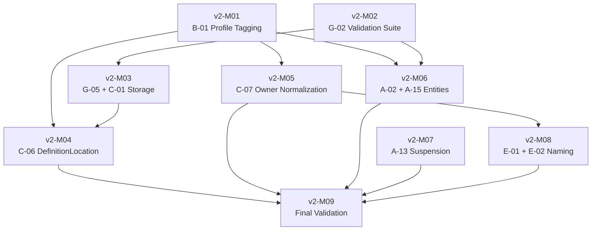

<!--
  ============================================
  RMM_v1.2_EXECUTION_PLAN.md — Engineering Kernel
  ============================================
  Classification:   NORMATIVE
  Authority:        GovernanceBody
  Source of Truth:  03-STANDARDS/ (per Constitution §10)
  Status:           Active
  Version:          1.0.0

  WARNING: This plan documents RMM v1.2 execution missions only.
  Actual RMM modification requires:
  1. GovernanceBody Plan Approval (for this document)
  2. Defined amendment procedure (currently [UNSUPPORTED] per Constitution §11.2)
  3. GovernanceBody Amendment Authorization (for specific RMM changes)
  None of these are executed in Phase 2.
  ============================================
-->

# RMM v1.2 EXECUTION PLAN

## Section A: Document Identification

| Property | Value |
|----------|-------|
| **Title** | RMM v1.2 Execution Plan |
| **Short** | RMM_v1.2_EXECUTION_PLAN |
| **Classification** | NORMATIVE |
| **Owner** | GovernanceBody |
| **Source of Truth** | `03-STANDARDS/` (per Constitution §10) |
| **Status** | Active |
| **Version** | 1.0.0 |
| **Scope** | Deterministic execution plan for 11 v1.2 proposals |
| **Total Proposals** | 11 |
| **Total Missions** | 9 |
| **Estimated Duration** | 3–4 engineering weeks |

---

## Section B: v1.2 Proposal Inventory

| ID | Title | Category | Effort | Priority | Dependencies | Cross-Release Dependency |
|----|-------|----------|--------|----------|-------------|------------------------|
| B-01 | Core vs Governance Profile Tagging | B — Entity Restructuring | Low | P1 | None | — |
| G-02 | Automated Validation Suite | G — Meta-Model Infrastructure | Medium | P1 | None | — |
| G-05 | Storage Abstraction | G — Meta-Model Infrastructure | Low-Medium | P2 | C-01 (coupled) | — |
| C-01 | Remove SOT from Entity Schema | C — Property Schema Evolution | Medium | P2 | G-05 (coupled) | — |
| C-06 | DefinitionLocation as 16th Property | C — Property Schema Evolution | Medium | P1 | B-01, C-01 | — |
| C-07 | Normalize Owner Field | C — Property Schema Evolution | Medium | P1 | B-01 | — |
| A-02 | Port, Bridge, Adapter, Bus Entities | A — New Entities | Medium | P1 | G-02 | — |
| A-15 | Dependency as Canonical Entity | A — New Entities | Medium | P1 | G-02, B-01 | — |
| A-13 | Suspension Entity | A — New Entities | Low | P2 | B-09 (v2.0) | Soft: can proceed without B-09 |
| E-01 | Remove "Radius1" Product Naming | E — Technology Independence | Low | P2 | A-06 (v2.0) | Soft: can proceed without A-06 |
| E-02 | Remove "Founders Circle" as Owner | E — Technology Independence | Low | P2 | C-07 | — |

---

## Section C: Dependency DAG

### C.1 Mission Dependency Matrix

| Mission | Proposals | Depends On | Required By |
|---------|-----------|-----------|-------------|
| v2-M01 | B-01 | — | v2-M04, v2-M05, v2-M06 |
| v2-M02 | G-02 | — | v2-M03, v2-M06 |
| v2-M03 | G-05, C-01 | v2-M02 | v2-M04 |
| v2-M04 | C-06 | v2-M01, v2-M03 | — |
| v2-M05 | C-07 | v2-M01 | v2-M08 |
| v2-M06 | A-02, A-15 | v2-M01, v2-M02 | — |
| v2-M07 | A-13 | — | — |
| v2-M08 | E-01, E-02 | v2-M05 | — |
| v2-M09 | FINAL VALIDATION | v2-M04, v2-M05, v2-M06, v2-M07, v2-M08 | — |

### C.2 Dependency DAG (Mermaid)



### C.3 Cycle Resolution

**G-05 ↔ C-01 Cycle:** G-05 (Storage Abstraction) and C-01 (Remove SOT) have mutual dependencies. These proposals are **architecturally coupled**: G-05 defines storage classes that C-01's storage-mapping matrix depends on, while C-01 removes SOT from the entity schema that G-05's deployment appendix references.

**Resolution:** G-05 and C-01 are merged into a single mission (v2-M03) executed as an atomic unit. Within v2-M03, execution order is: (1) define storage classes (G-05), (2) remove SOT from entity schema (C-01), (3) create storage-mapping matrix linking entity types to storage classes.

### C.4 Critical Path

```
v2-M01 (B-01) → v2-M05 (C-07) → v2-M08 (E-02)
```

**Critical path length:** 3 missions  
**Total missions:** 9  
**Maximum parallelism:** 4 missions (v2-M01, v2-M02, v2-M07 in parallel; then v2-M03, v2-M05, v2-M06 in parallel)

---

## Section D: Mission Definitions

### v2-M01: Core vs Governance Profile Tagging (B-01)

| Field | Value |
|-------|-------|
| **Mission ID** | v2-M01 |
| **Proposal** | B-01 |
| **Objective** | Introduce `Profile` attribute on all 79 entities: `Core` or `Governance Profile` |
| **Input** | `RMM_v1.1.md` (79 entities); governance philosophy decision |
| **Output** | Updated RMM with Profile column in entity definitions; classification rationale document |
| **Effort** | Low (tagging only) |
| **Risk** | Medium — politically sensitive governance philosophy decision |
| **Dependencies** | None |

**Execution Steps:**
1. Define `Core` criteria: structural/engineering entity, mandatory for all consumers
2. Define `Governance Profile` criteria: judicial/oversight entity, optional overlay
3. Classify all 79 entities
4. Update RMM entity tables with Profile column
5. Document classification rationale

**Acceptance Criteria:**
- All 79 entities have Profile = Core or Governance Profile
- Classification rationale documented
- Zero entities unclassified
- RMM version incremented to v1.2

---

### v2-M02: Automated Validation Suite (G-02)

| Field | Value |
|-------|-------|
| **Mission ID** | v2-M02 |
| **Proposal** | G-02 |
| **Objective** | Build automated validation suite: cycle detection, owner-uniqueness, referential-closure, count reconciliation, reciprocal-relationship check, matrix cross-consistency |
| **Input** | `RMM_v1.1.md`; `KERNEL_DEPENDENCY_MODEL.md`; all 10 matrices |
| **Output** | Validation suite tool; integration with CI/CD; automated report generation |
| **Effort** | Medium |
| **Risk** | Low — tooling effort, not model effort |
| **Dependencies** | None |

**Execution Steps:**
1. Implement cycle detection on Matrix 9 (Dependency Matrix)
2. Implement owner-uniqueness verification across 79 entities
3. Implement referential-closure check (no dangling references)
4. Implement count reconciliation (entity, relationship, type counts)
5. Implement reciprocal-relationship completeness check
6. Implement Matrix cross-consistency verification
7. Integrate with CI/CD pipeline
8. Attach output as Evidence on every model change

**Acceptance Criteria:**
- All 6 validation checks automated
- Suite runs on every RMM commit
- Report generated with PASS/FAIL for each check
- Zero false positives on v1.1 baseline

---

### v2-M03: Storage Abstraction + SOT Removal (G-05 + C-01)

| Field | Value |
|-------|-------|
| **Mission ID** | v2-M03 |
| **Proposals** | G-05, C-01 |
| **Objective** | Make storage classes normative; remove SOT from entity schema; create storage-mapping matrix |
| **Input** | `RMM_v1.1.md` §15 SOT matrix; Constitution §10 directory structure |
| **Output** | Updated RMM (SOT removed from entity schema); storage class definitions; storage-mapping matrix |
| **Effort** | Medium |
| **Risk** | Low — coordinated change, no semantic modification |
| **Dependencies** | v2-M02 (validation suite must verify changes) |

**Execution Steps:**
1. Define storage classes: Ledger, Registry, Vault, Repository, Store
2. Remove SOT property from per-entity 15-property schema
3. Create storage-mapping matrix (entity type → storage class)
4. Demote literal `NN-FOLDER/` paths to non-normative deployment appendix
5. Run validation suite to verify no broken references

**Acceptance Criteria:**
- Storage classes defined and documented
- SOT removed from all 79 entity definitions
- Storage-mapping matrix covers all entity types
- Validation suite passes on updated RMM
- Deployment appendix created with current folder paths as non-normative reference

---

### v2-M04: DefinitionLocation as 16th Property (C-06)

| Field | Value |
|-------|-------|
| **Mission ID** | v2-M04 |
| **Proposal** | C-06 |
| **Objective** | Add `DefinitionLocation` as 16th property capturing where canonical definition is stored |
| **Input** | Updated RMM from v2-M01 (Profile tagging); v2-M03 (storage classes) |
| **Output** | Updated RMM with 16th property; all 79 entities updated |
| **Effort** | Medium |
| **Risk** | Low — additive change, non-breaking |
| **Dependencies** | v2-M01 (Profile tagging), v2-M03 (Storage classes) |

**Execution Steps:**
1. Define DefinitionLocation property semantics
2. Add DefinitionLocation to entity schema template
3. Populate DefinitionLocation for all 79 entities
4. Resolve 13 [UNSUPPORTED] markers (US-001, 002, 005, 006, 007, 008, 009, 010, 012, 014, 018, 020, 028)
5. Run validation suite

**Acceptance Criteria:**
- All 79 entities have DefinitionLocation populated
- 13 [UNSUPPORTED] markers resolved
- Validation suite passes
- RMM version = v1.2

---

### v2-M05: Normalize Owner Field (C-07)

| Field | Value |
|-------|-------|
| **Mission ID** | v2-M05 |
| **Proposal** | C-07 |
| **Objective** | Restrict Owner to canonical entity references; eliminate free-form descriptors |
| **Input** | Updated RMM from v2-M01 (Profile tagging); `KERNEL_ROLE_MODEL.md` |
| **Output** | Updated RMM with normalized Owner values; Role instance definitions |
| **Effort** | Medium |
| **Risk** | Medium — politically sensitive; ~15 Owner fields affected |
| **Dependencies** | v2-M01 (Profile tagging) |

**Execution Steps:**
1. Inventory all free-form Owner descriptors
2. Define canonical Owner vocabulary
3. Map free-form descriptors to canonical references
4. Update all 79 entity Owner fields
5. Update Matrix 1 column headers
6. Run validation suite

**Acceptance Criteria:**
- Zero free-form Owner descriptors remain
- All Owner values reference canonical entities or Role instances
- Matrix 1 updated
- Validation suite passes

---

### v2-M06: New Structural Entities (A-02 + A-15)

| Field | Value |
|-------|-------|
| **Mission ID** | v2-M06 |
| **Proposals** | A-02, A-15 |
| **Objective** | Add Port, Bridge, Adapter, Bus, Dependency as canonical entities |
| **Input** | `RMM_v1.1.md`; v2-M01 (Profile tagging); v2-M02 (validation suite) |
| **Output** | Updated RMM with 5 new entities; relationship definitions; validation passed |
| **Effort** | Medium |
| **Risk** | Medium — graph expansion; ~30 new relationships |
| **Dependencies** | v2-M01 (Profile tagging), v2-M02 (validation suite) |

**Execution Steps:**
1. Define Port, Bridge, Adapter, Bus entities (Tier 3)
2. Define ~30 relationships and inverses
3. Define Dependency as canonical entity (Tier 13)
4. Run validation suite (cycle detection critical)
5. Update all affected matrices

**Acceptance Criteria:**
- 5 new entities defined with all 15 properties
- All relationships defined with inverses
- Validation suite passes (zero cycles)
- Entity count: 79 → 84

---

### v2-M07: Suspension Entity (A-13)

| Field | Value |
|-------|-------|
| **Mission ID** | v2-M07 |
| **Proposal** | A-13 |
| **Objective** | Add Suspension as canonical entity; resolve "Suspended" lifecycle state references |
| **Input** | `RMM_v1.1.md` lifecycle definitions |
| **Output** | Updated RMM with Suspension entity; lifecycle state resolution |
| **Effort** | Low |
| **Risk** | Low — self-contained addition |
| **Dependencies** | Soft dependency on B-09 (v2.0); can proceed without |

**Execution Steps:**
1. Define Suspension entity (purpose, lifecycle, relationships)
2. Determine placement: entity, lifecycle state, or event type
3. Update Charter, Exception, Waiver lifecycle definitions
4. Run validation suite

**Acceptance Criteria:**
- Suspension entity defined with all 15 properties
- Lifecycle state references resolved
- Validation suite passes
- Entity count: 84 → 85

---

### v2-M08: Technology Independence Cleanup (E-01 + E-02)

| Field | Value |
|-------|-------|
| **Mission ID** | v2-M08 |
| **Proposals** | E-01, E-02 |
| **Objective** | Remove "Radius1" and "Founders Circle" from RMM; replace with parameterized/generic references |
| **Input** | Updated RMM from v2-M05 (Owner normalization) |
| **Output** | Updated RMM with technology-independent naming; Owner field normalized |
| **Effort** | Low |
| **Risk** | Low — naming change only |
| **Dependencies** | v2-M05 (Owner normalization for E-02) |

**Execution Steps:**
1. Replace "Radius1" with parameterized system name
2. Replace "Founders Circle" with GovernanceBody reference
3. Audit for any remaining product/organization names
4. Run validation suite

**Acceptance Criteria:**
- Zero occurrences of "Radius1" in RMM entity definitions
- Zero occurrences of "Founders Circle" in RMM Owner fields
- Validation suite passes

---

### v2-M09: Final Validation

| Field | Value |
|-------|-------|
| **Mission ID** | v2-M09 |
| **Objective** | Comprehensive validation of all v1.2 changes; RMM v1.2 certification |
| **Input** | All v2-M01 through v2-M08 outputs; validation suite results |
| **Output** | RMM v1.2 Validation Report; certification decision |
| **Effort** | Low (automated) |
| **Risk** | Low |
| **Dependencies** | v2-M04, v2-M05, v2-M06, v2-M07, v2-M08 |

**Execution Steps:**
1. Run full validation suite on updated RMM
2. Verify all 37 [UNSUPPORTED] markers resolved (or documented)
3. Verify entity count = 85 (79 + 5 new - 0 merged in v1.2)
4. Verify relationship count updated
5. Produce RMM v1.2 Validation Report
6. GovernanceBody certification decision

**Acceptance Criteria:**
- Validation suite: 6/6 checks PASS
- Zero [UNSUPPORTED] markers in v1.2 scope unresolved
- All matrices consistent
- RMM v1.2 certified by GovernanceBody

---

## Section E: Parallelization Matrix

### E.1 Parallel Execution Groups

| Group | Missions | Trigger |
|-------|----------|---------|
| **Group 1** | v2-M01, v2-M02, v2-M07 | Phase 3 entry (no dependencies) |
| **Group 2** | v2-M03, v2-M05, v2-M06 | After Group 1 completes |
| **Group 3** | v2-M04 | After v2-M03 completes |
| **Group 4** | v2-M08 | After v2-M05 completes |
| **Group 5** | v2-M09 | After all other missions |

### E.2 Execution Timeline

| Phase | Missions | Duration | Cumulative |
|-------|----------|----------|------------|
| 1 | v2-M01, v2-M02, v2-M07 (parallel) | 1 week | 1 week |
| 2 | v2-M03, v2-M05, v2-M06 (parallel) | 1 week | 2 weeks |
| 3 | v2-M04 | 3 days | 2.5 weeks |
| 4 | v2-M08 | 2 days | 3 weeks |
| 5 | v2-M09 (validation) | 2 days | 3.5 weeks |

**Buffer:** 0.5 weeks for review and certification  
**Total estimated duration:** 3–4 engineering weeks

---

## Section F: Freeze Gates

### FG-v2-1: Pre-Execution Authority Gate

| Check | Method | Pass |
|-------|--------|------|
| Plan Approval obtained | Document review | GovernanceBody approved this plan |
| Amendment procedure defined | Constitution §11.2 | Procedure documented and ratified |
| Amendment Authorization granted | GovernanceBody vote | Specific RMM changes authorized |
| RMM v1.1 SHA baseline recorded | SHA capture | `09bc2239` documented |

### FG-v2-2: Mid-Execution Validation Gate

| Check | Method | Pass |
|-------|--------|------|
| v2-M01 through v2-M03 completed | Mission status | All PASS |
| Validation suite operational | Test run | 6/6 checks PASS on current RMM |
| No cycles introduced | Cycle detection | Zero cycles |

### FG-v2-3: Pre-Certification Gate

| Check | Method | Pass |
|-------|--------|------|
| All 9 missions completed | Mission status | All PASS |
| All [UNSUPPORTED] markers resolved | Tracker review | Zero unresolved in v1.2 scope |
| Validation suite passes | Automated test | 6/6 checks PASS |
| GovernanceBody certification vote | Vote | Majority approval |

---

## Section G: Risk Assessment

| Risk | Probability | Impact | Mitigation |
|------|------------|--------|------------|
| B-01 governance philosophy disagreement | Medium | High | Board-level decision required before execution |
| G-02 validation suite complexity | Low | Medium | Incremental development; start with cycle detection |
| C-01/C-06/C-07 schema change blast radius | Medium | Medium | Validation suite catches broken references immediately |
| A-02/A-15 graph expansion causing cycles | Medium | High | Validation suite cycle detection is prerequisite |
| E-01/E-02 organizational resistance | Low | Low | Pure naming change; no semantic impact |
| v2.0 dependency blocking (A-13, E-01) | Low | Low | Soft dependencies; proposals can proceed without v2.0 |

---

## Section H: Revision History

| Version | Date | Authority | Change | Mission | Description |
|---------|------|-----------|--------|---------|-------------|
| 1.0.0 | 2026-06-27 | GovernanceBody | Added | P2-M06 | Initial v1.2 execution plan: 11 proposals, 9 missions, 3 freeze gates |

---

*END OF RMM v1.2 EXECUTION PLAN*
